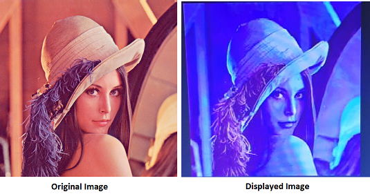

<h2 align="center">12-Bit VGA Vivado Project</h2>

This is a simple project to control VGA monitor using Pynq Z2 board. This project makes use of vivado block design, the design tcl file is included in the repo. This project makes use of HP 19ka monitor, optimal resolution supported by this monitor is 1366 x 768 at 60 Hz. The repo also includes sdk source code to display lena 24-Bit bmp colour image on the monitor. VGA Interface takes analog input, here we are using 4 bits for each R, G, and B. The input data must be converted into analog data using some kind of DAC. Here we use 4 bit weighted resistor DAC. 
The Connection between the Board and VGA connector is as shown below.

<h3>Image Data Extraction</h3>

* The image needs to be opened in HXd hex editor tool, remove 54 bytes header incase of 24-Bit bmp image.
* Copy the HEX raw data and paste into a text file.
* Text file needs to be passed to image_extract.v in order to convert HEX data into decimal data.
* image_extract.v also inverts the image data array for proper displaying.
* Include the extracted image array in the sdk image_data.h file.

As we make use of only 4 bits out of 8 bits for displaying, some of details will be lost. The comparision between original image and displayed image is as shown below.

Reference 
https://www.youtube.com/watch?v=_o4FbVFLbuw&list=PLXHMvqUANAFOviU0J8HSp0E91lLJInzX1&index=38
